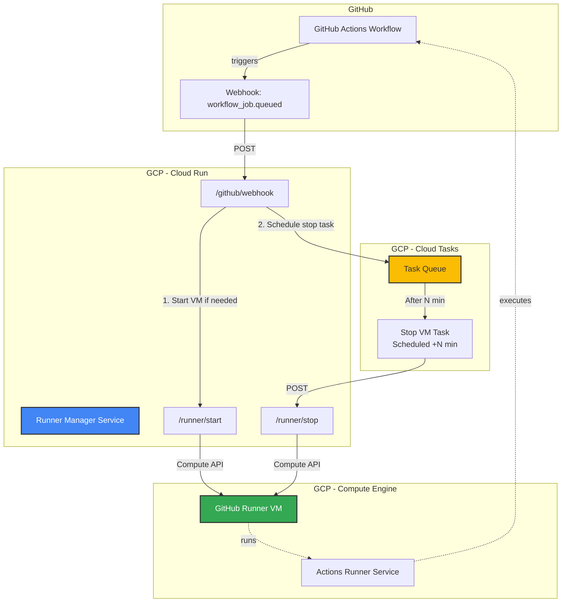

# GHA VM Self-Hosted Runner

Cost-efficient GitHub Actions self-hosted runner on GCP with automatic VM lifecycle management.

> [!IMPORTANT]
> This runner manager supports **repository-level self-hosted runners only**. Organization-level runners are not supported because the GitHub API does not provide accurate busy status for runners shared across multiple repositories in an organization.

## Motivation

This project addresses common challenges when running GitHub Actions self-hosted runners on GCP:

- **Cost Optimization**: Only run VMs when needed. Automatically stop VMs after periods of inactivity to minimize compute costs.
- **IP Address Control**: Manage static IP requirements for accessing restricted resources (databases, APIs with IP allowlists, etc.).
- **Simplicity**: Simple and straightforward setup using Terraform and a lightweight Cloud Run service.

By combining GCP VM instances with Cloud Run and Cloud Tasks, this solution provides:
- Pay only for what you use (VM only runs during active workflows)
- Automatic startup when workflows are queued
- Automatic shutdown after configurable inactivity period (default: 3 minutes)
- Persistent runner configuration across VM restarts

### When to Use This vs. Actions Runner Controller

For **large-scale deployments** with high workflow concurrency and dynamic scaling needs, consider using [Actions Runner Controller](https://docs.github.com/en/actions/concepts/runners/actions-runner-controller) (ARC) on Kubernetes. ARC excels at managing fleets of runners with auto-scaling capabilities.

This project is ideal for:
- **Personal development** or small team projects with moderate workflow frequency
- **Static IP requirements**: Scenarios where workflows need to access IP-restricted resources (databases, APIs, internal services with allowlists)
- **Simpler infrastructure**: Teams who want runner management without the complexity of Kubernetes
- **Cost-conscious projects**: Minimizing costs by running a single persistent VM that starts/stops automatically

## Architecture



### Flow

1. **Workflow Queued**: GitHub sends a `workflow_job.queued` webhook event to Cloud Run
2. **VM Start**: Runner Manager starts the VM if it's not already running
3. **Schedule Stop**: Creates a Cloud Task to stop the VM after configured inactivity period (default: 3 minutes)
4. **Execute Workflow**: The runner executes the queued workflow
5. **Auto Stop**: If no new workflows arrive within the inactivity period, Cloud Tasks triggers VM shutdown
6. **Repeat**: Each new workflow resets the inactivity timer

## Features

- **Automatic VM Lifecycle Management**: Start on demand, stop after inactivity
- **Cost Efficient**: Pay only for compute time during active workflows
- **Persistent Configuration**: Runner configuration survives VM restarts
- **Multi-Repository Support**: Single manager can handle multiple repositories with separate VMs
- **Infrastructure as Code**: Everything managed via Terraform
- **Secure Token Management**: GitHub runner tokens stored in Secret Manager
- **Configurable Inactivity Timeout**: Customize shutdown delay to match your workflow patterns

## Usage

### Prerequisites

- GCP Project with billing enabled
- GitHub organization or repository access
- Terraform installed
- `gcloud` CLI configured
- Docker Hub account (for custom image builds)

### Quick Start

1. **Create GitHub Runner Token and store in Secret Manager**:
   ```bash
   # Generate token from GitHub UI (Settings > Actions > Runners > New runner)
   echo -n "YOUR_RUNNER_TOKEN" | gcloud secrets create github-runner-token \
     --project=YOUR_PROJECT_ID \
     --data-file=-
   ```

2. **Deploy Runner VM**:
   ```bash
   cd terraform/github-runner-vm
   terraform init
   terraform apply
   ```

3. **Deploy Runner Manager**:
   ```bash
   cd terraform/github-runner-manager
   terraform init
   terraform apply
   ```

4. **Configure GitHub Webhook**:
   - Go to your GitHub organization/repository Settings > Webhooks
   - Add webhook with Cloud Run URL: `https://your-service-url.run.app/github/webhook`
   - Select event: `Workflow jobs`
   - Configure secret (get from Secret Manager: `gcloud secrets versions access latest --secret=runner-manager-secret`)

## CI/CD

### GitHub Actions Workflows

The project includes automated CI/CD pipelines:

#### Docker Build and Push
- **Workflow**: `.github/workflows/docker-publish.yml`
- **Triggers**:
  - Push to `main` branch
  - New version tags (`v*`)
  - Pull requests (build only, no push)
  - Manual workflow dispatch
- **Features**:
  - Multi-platform builds (amd64, arm64)
  - Automatic tagging strategy (latest, semver, sha)
  - Docker Hub description sync
  - GitHub Actions cache for faster builds

**Required Secrets**:
- `DOCKER_HUB_USERNAME`: Docker Hub username
- `DOCKER_HUB_TOKEN`: Docker Hub access token

#### Linting
- **Workflow**: `.github/workflows/lint.yml`
- **Triggers**: Push and pull requests affecting app code
- **Tools**: Ruff (Python linter and formatter)

### Setting Up Secrets

1. Create a Docker Hub access token:
   - Go to [Docker Hub Account Settings](https://hub.docker.com/settings/security)
   - Click "New Access Token"
   - Name it (e.g., "github-actions") and copy the token

2. Add secrets to your GitHub repository:
   - Go to repository Settings > Secrets and variables > Actions
   - Add `DOCKER_HUB_USERNAME` with your Docker Hub username
   - Add `DOCKER_HUB_TOKEN` with the access token

### Using the Docker Image

Pull the pre-built image from Docker Hub:

**For production:**
```bash
docker pull nakamasato/gha-vm-self-hosted-runner:latest
```

**For development/testing:**
```bash
docker pull nakamasato/gha-vm-self-hosted-runner-dev:latest
```

**Available tags:**

*PROD (`nakamasato/gha-vm-self-hosted-runner`):*
- `latest`: Latest release version
- `v1.0.0`, `v1.0`, `v1`: Semantic version tags (from git tags)

*DEV (`nakamasato/gha-vm-self-hosted-runner-dev`):*
- `latest`: Latest build from main branch
- `main`: Main branch builds
- `main-<sha>`: Commit-specific builds
- `pr-<number>`: Pull request builds

## Development

### Pre-commit Hooks

This project uses pre-commit hooks to ensure code quality:

```bash
# Install pre-commit
pip install pre-commit

# Install the git hooks
pre-commit install

# Run manually on all files
pre-commit run --all-files
```

The pre-commit configuration includes:
- **Ruff**: Python linter with auto-fix
- **Ruff Format**: Python code formatter
- **Standard hooks**: Trailing whitespace, end-of-file-fixer, YAML checks, etc.

## Details

This project consists of three main components:

### 1. [GitHub Runner VM](./terraform/github-runner-vm/)

Terraform module that creates a persistent GCP Compute Engine VM configured as a GitHub Actions self-hosted runner.

- Creates VM instance with customizable machine type and disk size
- Automatically installs and configures GitHub Actions runner on first boot
- Supports repository-level runners only
- Retrieves runner token from Secret Manager
- Includes startup script for automatic runner initialization

[See detailed documentation →](./terraform/github-runner-vm/README.md)

### 2. [Runner Manager](./app/runner-manager/)

FastAPI-based Cloud Run service that manages VM lifecycle in response to GitHub webhooks.

**Endpoints**:
- `POST /github/webhook` - Receives GitHub webhook events
- `POST /runner/start` - Starts the runner VM
- `POST /runner/stop` - Stops the runner VM

**Functionality**:
- Validates GitHub webhook signatures
- Starts VM when workflows are queued
- Schedules automatic VM shutdown using Cloud Tasks
- Updates shutdown schedule on each new workflow (keeps VM alive while active)

[See detailed documentation →](./app/runner-manager/README.md)

### 3. [Runner Manager Infrastructure](./terraform/github-runner-manager/)

Terraform configuration for deploying the Runner Manager service on GCP.

- Cloud Run service for the manager application
- Cloud Tasks queue for scheduled VM shutdown
- Service account with necessary IAM permissions
- Integration with Compute Engine API and Cloud Tasks API

[See detailed documentation →](./terraform/github-runner-manager/README.md)

## Limitations

### Runner Scope

**Repository-level runners only**: The runner manager is designed for **repository-level self-hosted runners**. It checks the busy status of a specific runner registered to a repository using the GitHub API.

For **organization-level self-hosted runners**, the current implementation may not return accurate runner status, as organization runners can be assigned to jobs from different repositories within the organization. If you need to manage organization-level runners, you may need to modify the implementation to check organization runners instead of repository runners.

### GitHub Token Management

This project currently uses a static GitHub token stored in Secret Manager, which has the following limitations:

1. **Token Expiration**:
   - **Registration tokens from GitHub UI**: Expire after **1 hour**
   - When recreating VM instances, you need to obtain a new token from GitHub UI
   - **Fine-Grained Personal Access Tokens (PATs)**: Expire after a maximum of 1 year
   - **Classic PATs**: Can be set to never expire, but are less secure

2. **Manual Token Rotation Required**:
   - The token stored in Secret Manager must be manually updated before expiration
   - No automatic token refresh mechanism is currently implemented
   - Expired tokens will prevent new runner registrations

3. **Recommended Approach**:
   - Use **Fine-Grained PATs** with the minimum required permissions:
     - Repository-level runners: `Repository permissions > Administration: Read and write`
   - Set token expiration to the maximum allowed period (1 year)
   - Implement a process to rotate tokens before expiration

### Future Improvements (TODO)

For a more robust solution, consider implementing:
- **GitHub App authentication**: Provides better security and automatic token refresh
- **Fine-Grained PAT configuration support**: Streamlined setup process for PAT-based authentication
- **Automated token rotation**: Using Cloud Functions or Cloud Run to periodically refresh tokens
- **Monitoring**: Alert when tokens are approaching expiration

## Contributing

Contributions are welcome! Please feel free to submit issues or pull requests.

## License

MIT License - see LICENSE file for details
