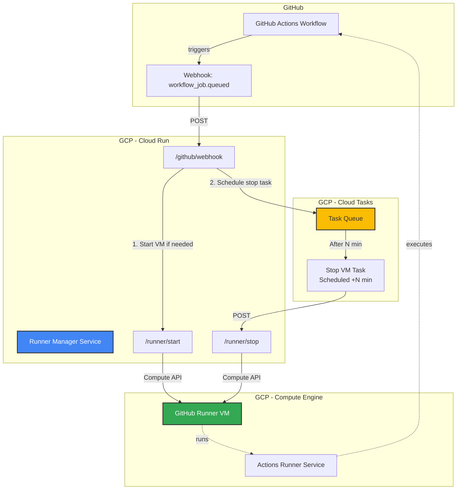

# GHA VM Self-Hosted Runner

Cost-efficient GitHub Actions self-hosted runner on GCP with automatic VM lifecycle management.

> [!IMPORTANT]
> This runner manager supports **repository-level self-hosted runners only**. Organization-level runners are not supported because the GitHub API does not provide accurate busy status for runners shared across multiple repositories in an organization.

## Motivation

This project addresses common challenges when running GitHub Actions self-hosted runners on GCP:

- **Cost Optimization**: Only run VMs when needed. Automatically stop VMs after periods of inactivity to minimize compute costs.
- **IP Address Control**: Manage static IP requirements for accessing restricted resources (databases, APIs with IP allowlists, etc.).
- **Simplicity**: Simple and straightforward setup using Terraform and a lightweight Cloud Run service.

By combining GCP VM instances with Cloud Run and Cloud Tasks, this solution provides:
- Pay only for what you use (VM only runs during active workflows)
- Automatic startup when workflows are queued
- Automatic shutdown after configurable inactivity period (default: 3 minutes)
- Persistent runner configuration across VM restarts

### When to Use GHA VM Self-Hosted Runner vs. Actions Runner Controller

For **large-scale deployments** with high workflow concurrency and dynamic scaling needs, consider using [Actions Runner Controller](https://docs.github.com/en/actions/concepts/runners/actions-runner-controller) (ARC) on Kubernetes. ARC excels at managing fleets of runners with auto-scaling capabilities.

This project is ideal for:
- **Personal development** or small team projects with moderate workflow frequency
- **Static IP requirements**: Scenarios where workflows need to access IP-restricted resources (databases, APIs, internal services with allowlists)
- **Simpler infrastructure**: Teams who want runner management without the complexity of Kubernetes
- **Cost-conscious projects**: Minimizing costs by running a single persistent VM that starts/stops automatically

## Architecture



### Flow

1. **Workflow Queued**: GitHub sends a `workflow_job.queued` webhook event to Cloud Run
2. **VM Start**: Runner Manager starts the VM if it's not already running
3. **Schedule Stop**: Creates a Cloud Task to stop the VM after configured inactivity period (default: 3 minutes)
4. **Execute Workflow**: The runner executes the queued workflow
5. **Auto Stop**: If no new workflows arrive within the inactivity period, Cloud Tasks triggers VM shutdown
6. **Repeat**: Each new workflow resets the inactivity timer

## Features

- **Automatic VM Lifecycle Management**: Start on demand, stop after inactivity
- **Cost Efficient**: Pay only for compute time during active workflows
- **Persistent Configuration**: Runner configuration survives VM restarts
- **Multi-Repository Support**: Single manager can handle multiple repositories with separate VMs
- **Infrastructure as Code**: Everything managed via Terraform
- **Secure Token Management**: GitHub runner tokens stored in Secret Manager
- **Configurable Inactivity Timeout**: Customize shutdown delay to match your workflow patterns

## Usage

### Prerequisites

- GCP Project with billing enabled
- GitHub organization or repository access
- Terraform installed
- `gcloud` CLI configured

### Quick Start

#### 1. Obtain GitHub Runner Registration Token

1. Go to your GitHub repository: **Settings > Actions > Runners > New self-hosted runner**
2. Copy the registration token from the configuration command (the token after `--token`)
3. Store it in Secret Manager:
   ```bash
   echo -n "YOUR_REGISTRATION_TOKEN" | gcloud secrets create github-runner-token \
     --project=YOUR_PROJECT_ID \
     --data-file=-
   ```

#### 2. Deploy Runner VM

```bash
cd terraform/github-runner-vm
cp terraform.tfvars.example terraform.tfvars
```

Edit `terraform.tfvars`:
```hcl
project       = "your-gcp-project-id"
instance_name = "github-runner"
machine_type  = "e2-standard-2"
zone          = "asia-northeast1-a"

boot_disk_size_gb = 20

github_runner_token_secret = "github-runner-token"
github_org                 = "your-github-org"
github_repo                = "your-repo"
```

Deploy:
```bash
terraform init
terraform apply
```

#### 3. Create GitHub App and Deploy Runner Manager

**Create GitHub App:**
1. Go to GitHub Settings > Developer settings > GitHub Apps > New GitHub App
2. Configure:
   - **Repository permissions**: Administration: Read-only
3. Install the app on your organization/repositories
4. Note: **App ID**, **Installation ID**, and download the **Private Key**

**Store GitHub App private key:**
```bash
gcloud secrets create github-app-private-key \
  --data-file=path/to/private-key.pem \
  --project=YOUR_PROJECT_ID
```

**Deploy Runner Manager:**
```bash
cd terraform/github-runner-manager
cp terraform.tfvars.example terraform.tfvars
```

Edit `terraform.tfvars`:
```hcl
project = "your-gcp-project-id"
region  = "asia-northeast1"
zone    = "asia-northeast1-a"

github_app_id              = "123456"
github_app_installation_id = "12345678"

runner_config = <<-EOT
[
  {
    "repo": "your-org/your-repo",
    "labels": ["self-hosted"],
    "vm_instance_name": "github-runner",
    "vm_instance_zone": "asia-northeast1-a"
  }
]
EOT

inactive_minutes = "3"
```

Deploy:
```bash
terraform init
terraform apply
```

#### 4. Configure GitHub Webhook

You can configure the webhook at either the **organization level** (recommended for managing multiple repositories) or **repository level**.

**Get the webhook URL and secret:**
```bash
terraform output webhook_url
gcloud secrets versions access latest --secret=runner-manager-secret --project=YOUR_PROJECT_ID
```

**For Organization-level webhook (recommended):**
1. Go to your GitHub organization: **Settings > Webhooks > Add webhook**
2. Configure:
   - **Payload URL**: Output from `terraform output webhook_url`
   - **Content type**: `application/json`
   - **Secret**: Output from the `gcloud secrets versions access` command
   - **Events**: Select "Workflow jobs"
   - **Active**: ✓ Checked

**For Repository-level webhook:**
1. Go to your repository: **Settings > Webhooks > Add webhook**
2. Use the same configuration as above

**Note**: Organization-level webhook allows you to manage all repositories with a single webhook configuration.

## Components

This project consists of three main components:

### 1. [GitHub Runner VM](./terraform/github-runner-vm/)

Terraform module that creates a persistent GCP Compute Engine VM configured as a GitHub Actions self-hosted runner.

- Creates VM instance with customizable machine type and disk size
- Automatically installs and configures GitHub Actions runner on first boot
- Supports repository-level runners only
- Retrieves runner token from Secret Manager
- Includes startup script for automatic runner initialization

[See detailed documentation →](./terraform/github-runner-vm/README.md)

### 2. Runner Manager

#### 2.1. [Runner Manager (App)](./app/runner-manager/)

FastAPI-based Cloud Run service that manages VM lifecycle in response to GitHub webhooks.

**Endpoints**:
- `POST /github/webhook` - Receives GitHub webhook events
- `POST /runner/start` - Starts the runner VM
- `POST /runner/stop` - Stops the runner VM

**Functionality**:
- Validates GitHub webhook signatures
- Starts VM when workflows are queued
- Schedules automatic VM shutdown using Cloud Tasks
- Updates shutdown schedule on each new workflow (keeps VM alive while active)

[See detailed documentation →](./app/runner-manager/README.md)

#### 2.2. [Runner Manager (Infrastructure)](./terraform/github-runner-manager/)

Terraform configuration for deploying the Runner Manager service on GCP.

- Cloud Run service for the manager application
- Cloud Tasks queue for scheduled VM shutdown
- Service account with necessary IAM permissions
- Integration with Compute Engine API and Cloud Tasks API

[See detailed documentation →](./terraform/github-runner-manager/README.md)

## Limitations

### Runner Scope

**Repository-level runners only**: The runner manager is designed for **repository-level self-hosted runners**. It checks the busy status of a specific runner registered to a repository using the GitHub API.

For **organization-level self-hosted runners**, the current implementation may not return accurate runner status, as organization runners can be assigned to jobs from different repositories within the organization. If you need to manage organization-level runners, you may need to modify the implementation to check organization runners instead of repository runners.

### GitHub Self-Hosted Runner Registration Token

To register the self-hosted runner on the VM, you need to obtain a **runner registration token** from GitHub's web UI (Repository Settings > Actions > Runners > New self-hosted runner). This token must be stored in Secret Manager before deploying the VM, and has the following limitations:

1. **Token Expiration**:
   - **Registration tokens from GitHub UI**: Expire after **1 hour**
   - When recreating VM instances, you need to obtain a new token from GitHub UI
   - **Fine-Grained Personal Access Tokens (PATs)**: Expire after a maximum of 1 year
   - **Classic PATs**: Can be set to never expire, but are less secure

2. **Manual Token Rotation Required**:
   - The token stored in Secret Manager must be manually updated before expiration
   - No automatic token refresh mechanism is currently implemented
   - Expired tokens will prevent new runner registrations

3. **Recommended Approach**:
   - Use **Fine-Grained PATs** with the minimum required permissions:
     - Repository-level runners: `Repository permissions > Administration: Read and write`
   - Set token expiration to the maximum allowed period (1 year)
   - Implement a process to rotate tokens before expiration

### Future Improvements (TODO)

For a more robust solution, consider implementing:
- **GitHub App authentication**: Provides better security and automatic token refresh
- **Fine-Grained PAT configuration support**: Streamlined setup process for PAT-based authentication
- **Automated token rotation**: Using Cloud Functions or Cloud Run to periodically refresh tokens
- **Monitoring**: Alert when tokens are approaching expiration

## Contributing

Contributions are welcome! Please feel free to submit issues or pull requests.

## License

MIT License - see LICENSE file for details
