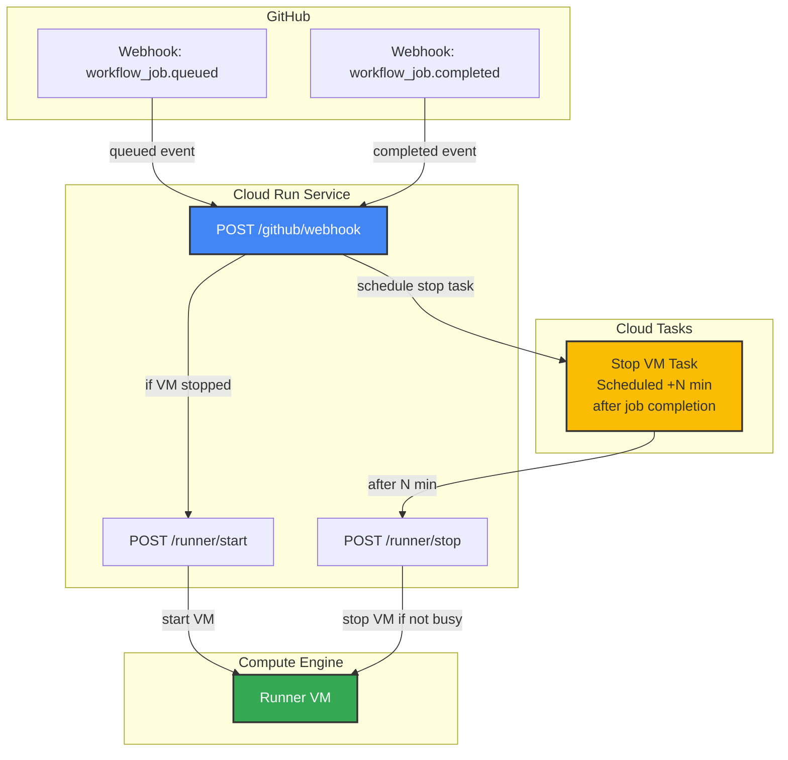
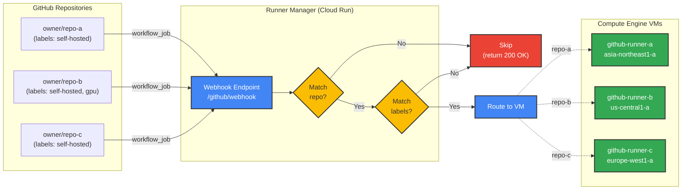
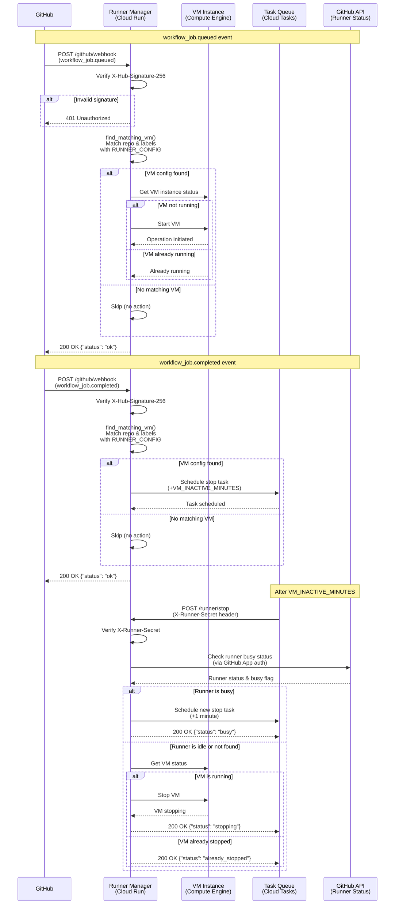

# Runner Manager

FastAPI-based Cloud Run service that manages GitHub Actions self-hosted runner VM lifecycle.

## Overview

This service receives GitHub webhook events and automatically manages the VM instance lifecycle:
- Starts the VM when workflows are queued (`workflow_job.queued`)
- Schedules automatic shutdown after job completion (`workflow_job.completed`)
- VM stops after configurable inactivity period (default: 15 minutes after last job completion)
- Prevents unnecessary compute costs by stopping idle VMs

## Architecture



### Multi-Repository Support

The Runner Manager supports multiple repositories with separate VMs from a single Cloud Run service. Each webhook event is matched against the `RUNNER_CONFIG` to determine which VM to manage.

**Configuration-Based Routing:**



**Matching Logic:**

1. **Repository Match**: First checks if `repository.full_name` from the webhook matches any `repo` in `RUNNER_CONFIG`
2. **Label Match**: Then verifies that **ALL** configured `labels` are present in the job's labels
3. **VM Selection**: If both match, the corresponding `vm_instance_name` and `vm_instance_zone` are used
4. **Skip**: If no match is found, the event is ignored (returns `200 OK`)

**Example Configuration:**

```json
[
  {
    "repo": "owner/repo-a",
    "labels": ["self-hosted"],
    "vm_instance_name": "github-runner-a",
    "vm_instance_zone": "asia-northeast1-a"
  },
  {
    "repo": "owner/repo-b",
    "labels": ["self-hosted", "gpu"],
    "vm_instance_name": "github-runner-b",
    "vm_instance_zone": "us-central1-a"
  },
  {
    "repo": "owner/repo-c",
    "labels": ["self-hosted"],
    "vm_instance_name": "github-runner-c",
    "vm_instance_zone": "europe-west1-a"
  }
]
```

**Benefits:**

- Single Cloud Run service manages multiple repositories
- Independent VMs per repository for isolation
- VMs can be in different zones/regions
- Flexible label-based routing
- Cost-effective (only one webhook endpoint, shared infrastructure)

## Security

### Shared Secret Authentication

All authenticated endpoints use a shared secret for authentication:

**Protected Endpoints:**
- `/github/webhook` - GitHub webhook verification (HMAC SHA256)
- `/runner/start` - VM start control
- `/runner/stop` - VM stop control

**How it works:**
1. **GitHub Webhooks**: Uses `X-Hub-Signature-256` header with HMAC SHA256 signature
2. **Runner Control**: Uses `X-Runner-Secret` header with the same secret value
3. **Cloud Tasks**: Automatically includes the secret in the `X-Runner-Secret` header

**Benefits:**
- Single secret to manage for all authentication
- No complex IAM permissions required
- Simple and secure

**Manual Access Example:**
```bash
# Get the secret from Secret Manager
SECRET=$(gcloud secrets versions access latest --secret="runner-manager-secret")

# Call runner control endpoints
curl -H "X-Runner-Secret: $SECRET" \
  https://your-service-url.run.app/runner/start -X POST

curl -H "X-Runner-Secret: $SECRET" \
  https://your-service-url.run.app/runner/stop -X POST
```

## Endpoints

### `POST /github/webhook`
Receives GitHub webhook events for VM lifecycle management.

**Supported Events:**
- `workflow_job.queued` - Starts VM when a job is queued
- `workflow_job.completed` - Schedules VM stop after job completion

**Headers:**
- `X-Hub-Signature-256`: GitHub webhook signature for verification
- `X-GitHub-Event`: Event type

**Payload Example:**
```json
{
  "action": "queued",
  "workflow_job": {
    "id": 123456789,
    "run_id": 987654321,
    "status": "queued",
    "labels": ["self-hosted", "linux", "x64"],
    "runner_id": null,
    "runner_name": null,
    "runner_group_id": null,
    "runner_group_name": null
  },
  "repository": {
    "name": "example-repo",
    "full_name": "org/example-repo"
  }
}
```

**Processing Flow:**

The service handles two webhook events to manage VM lifecycle:

1. **workflow_job.queued** - Starts VM when a job is queued
2. **workflow_job.completed** - Schedules VM stop after job completion



**Documentation:**
- [GitHub Webhook Events: workflow_job](https://docs.github.com/en/webhooks/webhook-events-and-payloads#workflow_job)

**Response:**
```json
{"status": "ok"}
```

### `POST /runner/start`
Manually start the runner VM.

**Authentication:**
- Requires shared secret in `X-Runner-Secret` header
- Same secret used for GitHub webhook verification

**Example:**
```bash
SECRET=$(gcloud secrets versions access latest --secret="runner-manager-secret")
curl -H "X-Runner-Secret: $SECRET" \
  https://your-service-url.run.app/runner/start -X POST
```

**Response:**
```json
{
  "status": "starting",
  "operation": "operation-xxx"
}
```
or
```json
{"status": "already_running"}
```

### `POST /runner/stop`
Manually stop the runner VM.

**Authentication:**
- Requires shared secret in `X-Runner-Secret` header
- Same secret used for GitHub webhook verification

**Example:**
```bash
SECRET=$(gcloud secrets versions access latest --secret="runner-manager-secret")
curl -H "X-Runner-Secret: $SECRET" \
  https://your-service-url.run.app/runner/stop -X POST
```

**Response:**
```json
{
  "status": "stopping",
  "operation": "operation-xxx"
}
```
or
```json
{"status": "already_stopped"}
```

### `GET /health`
Health check endpoint for Cloud Run.

**Response:**
```json
{"status": "healthy"}
```

### `GET /`
Service information.

**Response:**
```json
{
  "service": "GitHub Runner Manager",
  "inactive_minutes": 3,
  "runner_configs": [
    {
      "repo": "owner/repo-a",
      "labels": ["self-hosted"],
      "vm_instance_name": "github-runner-a",
      "vm_instance_zone": "asia-northeast1-a"
    },
    {
      "repo": "owner/repo-b",
      "labels": ["self-hosted", "gpu"],
      "vm_instance_name": "github-runner-b",
      "vm_instance_zone": "us-central1-a"
    }
  ]
}
```

## Environment Variables

| Variable | Description | Required | Example |
|----------|-------------|----------|---------|
| `GCP_PROJECT_ID` | GCP project ID | Yes | `my-project` |
| `CLOUD_TASK_LOCATION` | Cloud Tasks location | Yes | `asia-northeast1` |
| `CLOUD_TASK_QUEUE_NAME` | Cloud Tasks queue name | Yes | `runner-manager` |
| `CLOUD_RUN_SERVICE_URL` | Cloud Run service URL | Yes | `https://service-xxx.run.app` |
| `RUNNER_MANAGER_SECRET` | Shared secret for authentication (GitHub webhook and runner control) | Yes | `your-secret` |
| `VM_INACTIVE_MINUTES` | Minutes before auto-stop after job completion | No | `3` (default) |
| `GITHUB_APP_ID` | GitHub App ID for authentication | Yes | `123456` |
| `GITHUB_APP_PRIVATE_KEY` | GitHub App private key (PEM format) | Yes | `<PEM-formatted-private-key>` |
| `GITHUB_APP_INSTALLATION_ID` | GitHub App Installation ID (same for all repositories) | Yes | `12345678` |
| `RUNNER_CONFIG` | JSON array of runner configurations (see below) | Yes | `[{"repo": "owner/repo", "labels": ["self-hosted"], "vm_instance_name": "runner-1", "vm_instance_zone": "asia-northeast1-a"}]` |

**Runner Configuration (`RUNNER_CONFIG`):**

`RUNNER_CONFIG` is a JSON array where each entry defines a repository-VM mapping:

```json
[
  {
    "repo": "owner/repo-name",
    "labels": ["self-hosted", "optional-label"],
    "vm_instance_name": "github-runner-1",
    "vm_instance_zone": "asia-northeast1-a"
  }
]
```

**Fields:**
- `repo` (string, required): Repository full name (format: `owner/repo`)
- `labels` (array, required): Runner labels that must ALL be present in the job
- `vm_instance_name` (string, required): GCE VM instance name
- `vm_instance_zone` (string, required): GCE VM instance zone

**Matching Behavior:**
1. The service checks the `repository.full_name` and `labels` from the `workflow_job` webhook
2. VM is only managed if the repository matches AND all configured labels are present in the job
3. Multiple repositories can share the same VM by using identical `vm_instance_name` and `vm_instance_zone`
4. Example workflow: `runs-on: [self-hosted, linux, gpu]` matches `"labels": ["self-hosted", "linux"]` (subset match)

**Logging Configuration:**
- The service automatically detects if it's running on Cloud Run by checking the `K_SERVICE` environment variable
- **Cloud Run**: Uses Cloud Logging (logs appear in GCP Cloud Logging console)
- **Local development**: Uses local logging with `logging.basicConfig`
- No manual configuration required

## Development

### Prerequisites

- Python 3.11+
- [uv](https://github.com/astral-sh/uv) package manager

### Setup

1. Set environment variables:
   ```bash
   # Copy the example environment file
   cp .env.example .env

   # Edit .env with your actual values
   # Then load it:
   source .env

   # Or export variables directly:
   export GCP_PROJECT_ID=your-project
   export CLOUD_TASK_LOCATION=asia-northeast1
   export CLOUD_TASK_QUEUE_NAME=runner-manager
   export CLOUD_RUN_SERVICE_URL=http://localhost:8080
   export RUNNER_MANAGER_SECRET=your-secret
   export VM_INACTIVE_MINUTES=3
   export GITHUB_APP_ID=123456
   export GITHUB_APP_PRIVATE_KEY="$(cat path/to/private-key.pem)"
   export GITHUB_APP_INSTALLATION_ID=12345678
   export RUNNER_CONFIG='[{"repo":"owner/repo","labels":["self-hosted"],"vm_instance_name":"github-runner","vm_instance_zone":"asia-northeast1-a"}]'
   ```

2. Run locally:
   ```bash
   # Using uv run (automatically installs dependencies from pyproject.toml)
   uv run uvicorn app:app --reload --port 8080
   ```

   The first run will automatically install all dependencies. Subsequent runs will be faster.

### Linting

```bash
# Lint check
uv run ruff check .

# Format check
uv run ruff format --check .

# Auto-fix and format
uv run ruff check --fix .
uv run ruff format .
```

## Docker

### Build

```bash
docker build -t github-runner-manager .
```

### Run locally

```bash
docker run -p 8080:8080 \
  -e GCP_PROJECT_ID=your-project \
  -e CLOUD_TASK_LOCATION=asia-northeast1 \
  -e CLOUD_TASK_QUEUE_NAME=runner-manager \
  -e CLOUD_RUN_SERVICE_URL=http://localhost:8080 \
  -e RUNNER_MANAGER_SECRET=your-secret \
  -e VM_INACTIVE_MINUTES=3 \
  -e GITHUB_APP_ID=123456 \
  -e GITHUB_APP_PRIVATE_KEY="$(cat path/to/private-key.pem)" \
  -e GITHUB_APP_INSTALLATION_ID=12345678 \
  -e RUNNER_CONFIG='[{"repo":"owner/repo","labels":["self-hosted"],"vm_instance_name":"github-runner","vm_instance_zone":"asia-northeast1-a"}]' \
  github-runner-manager
```

### Deploy to Cloud Run

For infrastructure-as-code deployment including Cloud Tasks queue setup, see the [Terraform configuration documentation](../../terraform/github-runner-manager/README.md).
