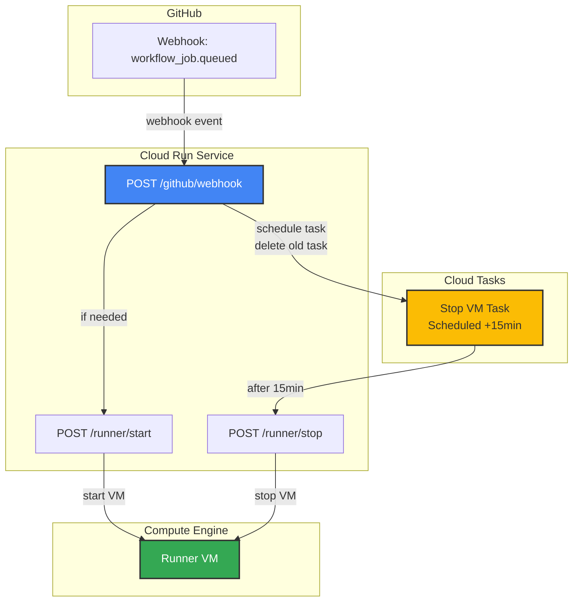
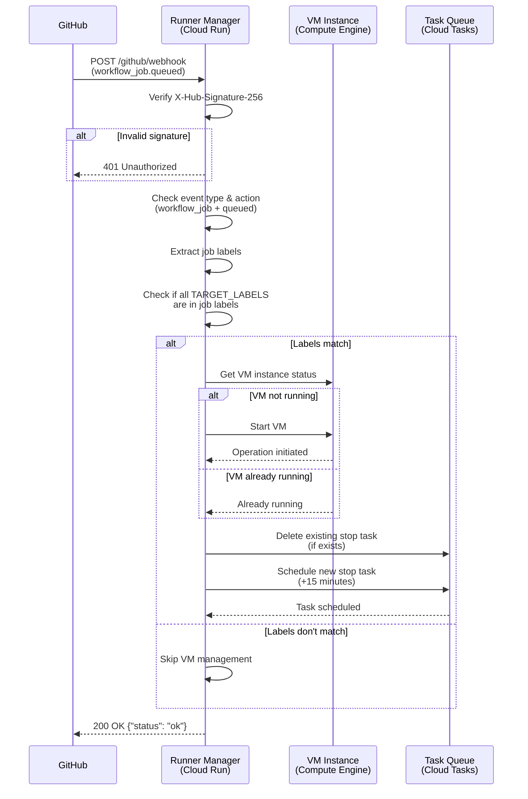

# Runner Manager

FastAPI-based Cloud Run service that manages GitHub Actions self-hosted runner VM lifecycle.

## Overview

This service receives GitHub webhook events and automatically manages the VM instance lifecycle:
- Starts the VM when workflows are queued
- Schedules automatic shutdown after configurable inactivity period
- Prevents unnecessary compute costs by stopping idle VMs

## Architecture



## Endpoints

### `POST /github/webhook`
Receives GitHub webhook events (specifically `workflow_job.queued`).

**Headers:**
- `X-Hub-Signature-256`: GitHub webhook signature for verification
- `X-GitHub-Event`: Event type

**Payload Example:**
```json
{
  "action": "queued",
  "workflow_job": {
    "id": 123456789,
    "run_id": 987654321,
    "status": "queued",
    "labels": ["self-hosted", "linux", "x64"],
    "runner_id": null,
    "runner_name": null,
    "runner_group_id": null,
    "runner_group_name": null
  },
  "repository": {
    "name": "example-repo",
    "full_name": "org/example-repo"
  }
}
```

**Processing Flow:**


**Documentation:**
- [GitHub Webhook Events: workflow_job](https://docs.github.com/en/webhooks/webhook-events-and-payloads#workflow_job)

**Response:**
```json
{"status": "ok"}
```

### `POST /runner/start`
Manually start the runner VM.

**Response:**
```json
{
  "status": "starting",
  "operation": "operation-xxx"
}
```
or
```json
{"status": "already_running"}
```

### `POST /runner/stop`
Manually stop the runner VM.

**Response:**
```json
{
  "status": "stopping",
  "operation": "operation-xxx"
}
```
or
```json
{"status": "already_stopped"}
```

### `GET /health`
Health check endpoint for Cloud Run.

**Response:**
```json
{"status": "healthy"}
```

### `GET /`
Service information.

**Response:**
```json
{
  "service": "GitHub Runner Manager",
  "instance": "vm-name",
  "zone": "asia-northeast1-a",
  "inactive_minutes": 15
}
```

## Environment Variables

| Variable | Description | Required | Example |
|----------|-------------|----------|---------|
| `GCP_PROJECT_ID` | GCP project ID | Yes | `my-project` |
| `VM_INSTANCE_ZONE` | VM instance zone | Yes | `asia-northeast1-a` |
| `VM_INSTANCE_NAME` | VM instance name | Yes | `github-runner` |
| `VM_INACTIVE_MINUTES` | Minutes before auto-stop | No | `15` (default) |
| `CLOUD_TASK_LOCATION` | Cloud Tasks location | Yes | `asia-northeast1` |
| `CLOUD_TASK_QUEUE_NAME` | Cloud Tasks queue name | Yes | `runner-manager` |
| `CLOUD_TASK_SERVICE_ACCOUNT_EMAIL` | Service account for Cloud Tasks (for future OIDC validation) | No | `runner-manager@project.iam.gserviceaccount.com` |
| `CLOUD_RUN_SERVICE_URL` | Cloud Run service URL | Yes | `https://service-xxx.run.app` |
| `GITHUB_WEBHOOK_SECRET` | GitHub webhook secret | Yes | `your-secret` |
| `TARGET_LABELS` | Comma-separated runner labels to target | No | `self-hosted` (default)<br/>`self-hosted,linux`<br/>`self-hosted,gpu` |

**Label Filtering (`TARGET_LABELS`):**
1. The service checks the `labels` field in the `workflow_job` webhook payload
2. VM is only started if **ALL** target labels are present in the job labels
3. Default: `self-hosted` (manages any self-hosted runner job)
4. Example workflow: `runs-on: [self-hosted, linux, gpu]` matches `TARGET_LABELS=self-hosted,linux,gpu`

**Logging Configuration:**
- The service automatically detects if it's running on Cloud Run by checking the `K_SERVICE` environment variable
- **Cloud Run**: Uses Cloud Logging (logs appear in GCP Cloud Logging console)
- **Local development**: Uses local logging with `logging.basicConfig`
- No manual configuration required

## Development

### Prerequisites

- Python 3.11+
- [uv](https://github.com/astral-sh/uv) package manager

### Setup

1. Set environment variables:
   ```bash
   # Copy the example environment file
   cp .env.example .env

   # Edit .env with your actual values
   # Then load it:
   source .env

   # Or export variables directly:
   export GCP_PROJECT_ID=your-project
   export VM_INSTANCE_ZONE=asia-northeast1-a
   export VM_INSTANCE_NAME=github-runner
   export VM_INACTIVE_MINUTES=15
   export CLOUD_TASK_LOCATION=asia-northeast1
   export CLOUD_TASK_QUEUE_NAME=runner-manager
   export CLOUD_TASK_SERVICE_ACCOUNT_EMAIL=runner-manager@your-project.iam.gserviceaccount.com
   export CLOUD_RUN_SERVICE_URL=http://localhost:8080
   export GITHUB_WEBHOOK_SECRET=your-secret
   ```

2. Run locally:
   ```bash
   # Using uv run (automatically installs dependencies from pyproject.toml)
   uv run uvicorn app:app --reload --port 8080
   ```

   The first run will automatically install all dependencies. Subsequent runs will be faster.

### Linting

```bash
# Lint check
uv run ruff check .

# Format check
uv run ruff format --check .

# Auto-fix and format
uv run ruff check --fix .
uv run ruff format .
```

## Docker

### Build

```bash
docker build -t github-runner-manager .
```

### Run locally

```bash
docker run -p 8080:8080 \
  -e GCP_PROJECT_ID=your-project \
  -e VM_INSTANCE_ZONE=asia-northeast1-a \
  -e VM_INSTANCE_NAME=github-runner \
  -e VM_INACTIVE_MINUTES=15 \
  -e CLOUD_TASK_LOCATION=asia-northeast1 \
  -e CLOUD_TASK_QUEUE_NAME=runner-manager \
  -e CLOUD_TASK_SERVICE_ACCOUNT_EMAIL=runner-manager@your-project.iam.gserviceaccount.com \
  -e CLOUD_RUN_SERVICE_URL=http://localhost:8080 \
  -e GITHUB_WEBHOOK_SECRET=your-secret \
  github-runner-manager
```

### Deploy to Cloud Run

For infrastructure-as-code deployment including Cloud Tasks queue setup, see the [Terraform configuration documentation](../../terraform/github-runner-manager/README.md).
