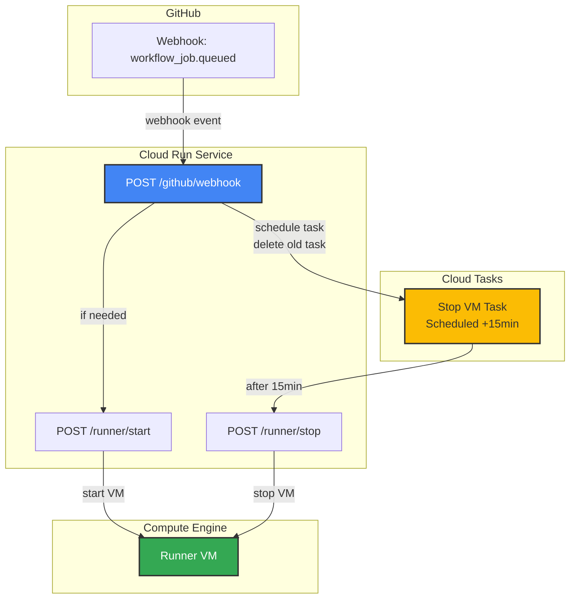

# Runner Manager

FastAPI-based Cloud Run service that manages GitHub Actions self-hosted runner VM lifecycle.

## Overview

This service receives GitHub webhook events and automatically manages the VM instance lifecycle:
- Starts the VM when workflows are queued
- Schedules automatic shutdown after configurable inactivity period
- Prevents unnecessary compute costs by stopping idle VMs

## Architecture



## Endpoints

### `POST /github/webhook`
Receives GitHub webhook events (specifically `workflow_job.queued`).

**Headers:**
- `X-Hub-Signature-256`: GitHub webhook signature for verification
- `X-GitHub-Event`: Event type

**Response:**
```json
{"status": "ok"}
```

### `POST /runner/start`
Manually start the runner VM.

**Response:**
```json
{
  "status": "starting",
  "operation": "operation-xxx"
}
```
or
```json
{"status": "already_running"}
```

### `POST /runner/stop`
Manually stop the runner VM.

**Response:**
```json
{
  "status": "stopping",
  "operation": "operation-xxx"
}
```
or
```json
{"status": "already_stopped"}
```

### `GET /health`
Health check endpoint for Cloud Run.

**Response:**
```json
{"status": "healthy"}
```

### `GET /`
Service information.

**Response:**
```json
{
  "service": "GitHub Runner Manager",
  "instance": "vm-name",
  "zone": "asia-northeast1-a",
  "inactive_minutes": 15
}
```

## Environment Variables

| Variable | Description | Required | Example |
|----------|-------------|----------|---------|
| `GCP_PROJECT_ID` | GCP project ID | Yes | `my-project` |
| `VM_INSTANCE_ZONE` | VM instance zone | Yes | `asia-northeast1-a` |
| `VM_INSTANCE_NAME` | VM instance name | Yes | `github-runner` |
| `VM_INACTIVE_MINUTES` | Minutes before auto-stop | No | `15` (default) |
| `CLOUD_TASK_LOCATION` | Cloud Tasks location | Yes | `asia-northeast1` |
| `CLOUD_TASK_QUEUE_NAME` | Cloud Tasks queue name | Yes | `runner-controller` |
| `CLOUD_RUN_SERVICE_URL` | Cloud Run service URL | Yes | `https://service-xxx.run.app` |
| `GITHUB_WEBHOOK_SECRET` | GitHub webhook secret | Yes | `your-secret` |
| `TARGET_LABELS` | Comma-separated runner labels to target | No | `self-hosted` (default)<br/>`self-hosted,linux`<br/>`self-hosted,gpu` |

**Label Filtering (`TARGET_LABELS`):**
1. The service checks the `labels` field in the `workflow_job` webhook payload
2. VM is only started if **ALL** target labels are present in the job labels
3. Default: `self-hosted` (manages any self-hosted runner job)
4. Example workflow: `runs-on: [self-hosted, linux, gpu]` matches `TARGET_LABELS=self-hosted,linux,gpu`

## Development

### Prerequisites

- Python 3.11+
- [uv](https://github.com/astral-sh/uv) package manager

### Setup

1. Set environment variables:
   ```bash
   # Copy the example environment file
   cp .env.example .env

   # Edit .env with your actual values
   # Then load it:
   source .env

   # Or export variables directly:
   export GCP_PROJECT_ID=your-project
   export VM_INSTANCE_ZONE=asia-northeast1-a
   export VM_INSTANCE_NAME=github-runner
   export VM_INACTIVE_MINUTES=15
   export CLOUD_TASK_LOCATION=asia-northeast1
   export CLOUD_TASK_QUEUE_NAME=runner-controller
   export CLOUD_RUN_SERVICE_URL=http://localhost:8080
   export GITHUB_WEBHOOK_SECRET=your-secret
   ```

2. Run locally:
   ```bash
   # Using uv run (automatically installs dependencies from pyproject.toml)
   uv run uvicorn app:app --reload --port 8080
   ```

   The first run will automatically install all dependencies. Subsequent runs will be faster.

### Linting

```bash
# Lint check
uv run ruff check .

# Format check
uv run ruff format --check .

# Auto-fix and format
uv run ruff check --fix .
uv run ruff format .
```

## Docker

### Build

```bash
docker build -t github-runner-manager .
```

### Run locally

```bash
docker run -p 8080:8080 \
  -e GCP_PROJECT_ID=your-project \
  -e VM_INSTANCE_ZONE=asia-northeast1-a \
  -e VM_INSTANCE_NAME=github-runner \
  -e VM_INACTIVE_MINUTES=15 \
  -e CLOUD_TASK_LOCATION=asia-northeast1 \
  -e CLOUD_TASK_QUEUE_NAME=runner-controller \
  -e CLOUD_RUN_SERVICE_URL=http://localhost:8080 \
  -e GITHUB_WEBHOOK_SECRET=your-secret \
  github-runner-manager
```

### Deploy to Cloud Run

#### Option 1: Use pre-built Docker Hub image

**For production:**
```bash
# Deploy from PROD Docker Hub repository
gcloud run deploy github-runner-manager \
  --image nakamasato/gha-vm-self-hosted-runner:latest \
  --platform managed \
  --region asia-northeast1 \
  --set-env-vars GCP_PROJECT_ID=PROJECT_ID,VM_INSTANCE_ZONE=ZONE,VM_INSTANCE_NAME=NAME,VM_INACTIVE_MINUTES=15,CLOUD_TASK_LOCATION=LOCATION,CLOUD_TASK_QUEUE_NAME=QUEUE,CLOUD_RUN_SERVICE_URL=SERVICE_URL,GITHUB_WEBHOOK_SECRET=SECRET \
  --service-account runner-controller@PROJECT_ID.iam.gserviceaccount.com \
  --allow-unauthenticated
```

**For development/testing:**
```bash
# Deploy from DEV Docker Hub repository
gcloud run deploy github-runner-manager-dev \
  --image nakamasato/gha-vm-self-hosted-runner-dev:latest \
  --platform managed \
  --region asia-northeast1 \
  --set-env-vars GCP_PROJECT_ID=PROJECT_ID,VM_INSTANCE_ZONE=ZONE,VM_INSTANCE_NAME=NAME,VM_INACTIVE_MINUTES=15,CLOUD_TASK_LOCATION=LOCATION,CLOUD_TASK_QUEUE_NAME=QUEUE,CLOUD_RUN_SERVICE_URL=SERVICE_URL,GITHUB_WEBHOOK_SECRET=SECRET \
  --service-account runner-controller@PROJECT_ID.iam.gserviceaccount.com \
  --allow-unauthenticated
```

#### Option 2: Build and deploy custom image

```bash
# Build and push to Google Container Registry
gcloud builds submit --tag gcr.io/PROJECT_ID/github-runner-manager

# Deploy to Cloud Run
gcloud run deploy github-runner-manager \
  --image gcr.io/PROJECT_ID/github-runner-manager \
  --platform managed \
  --region asia-northeast1 \
  --set-env-vars GCP_PROJECT_ID=PROJECT_ID,VM_INSTANCE_ZONE=ZONE,VM_INSTANCE_NAME=NAME,VM_INACTIVE_MINUTES=15,CLOUD_TASK_LOCATION=LOCATION,CLOUD_TASK_QUEUE_NAME=QUEUE,CLOUD_RUN_SERVICE_URL=SERVICE_URL,GITHUB_WEBHOOK_SECRET=SECRET \
  --service-account runner-controller@PROJECT_ID.iam.gserviceaccount.com \
  --allow-unauthenticated
```

## Implementation Details

```py
from fastapi import FastAPI, Request, Header, HTTPException
from google.cloud import compute_v1, tasks_v2
from datetime import datetime, timedelta, timezone
import hmac, hashlib, os

app = FastAPI()

GCP_PROJECT_ID = os.getenv("GCP_PROJECT_ID")
VM_INSTANCE_ZONE = os.getenv("VM_INSTANCE_ZONE")
VM_INSTANCE_NAME = os.getenv("VM_INSTANCE_NAME")
VM_INACTIVE_MINUTES = int(os.getenv("VM_INACTIVE_MINUTES", "15"))
CLOUD_TASK_LOCATION = os.getenv("CLOUD_TASK_LOCATION")
CLOUD_TASK_QUEUE_NAME = os.getenv("CLOUD_TASK_QUEUE_NAME")
CLOUD_RUN_SERVICE_URL = os.getenv("CLOUD_RUN_SERVICE_URL")

tasks_client = tasks_v2.CloudTasksClient()
compute_client = compute_v1.InstancesClient()

@app.post("/github/webhook")
async def github_webhook(request: Request, x_hub_signature_256:
str = Header(None)):
    """GitHub Webhookを受信"""
    payload = await request.json()

    # Webhook検証
    if not verify_signature(await request.body(), x_hub_signature_256):
        raise HTTPException(status_code=401, detail="Invalid signature")

    event = request.headers.get('X-GitHub-Event')

    if event == 'workflow_job' and payload.get('action') == 'queued':
        # VM起動（必要なら）
        await start_runner_if_needed()

        # 古いstopタスクを削除して新しいタスクをスケジュール
        await schedule_stop_task()

    return {"status": "ok"}

@app.post("/runner/start")
async def start_runner():
    """VMを起動"""
    instance = compute_client.get(
        project=PROJECT_ID,
        zone=ZONE,
        instance=INSTANCE_NAME
    )

    if instance.status != "RUNNING":
        operation = compute_client.start(
            project=PROJECT_ID,
            zone=ZONE,
            instance=INSTANCE_NAME
        )
        return {"status": "starting", "operation": operation.name}

    return {"status": "already_running"}

@app.post("/runner/stop")
async def stop_runner():
    """VMを停止"""
    instance = compute_client.get(
        project=PROJECT_ID,
        zone=ZONE,
        instance=INSTANCE_NAME
    )

    if instance.status == "RUNNING":
        operation = compute_client.stop(
            project=PROJECT_ID,
            zone=ZONE,
            instance=INSTANCE_NAME
        )
        return {"status": "stopping", "operation": operation.name}

    return {"status": "already_stopped"}

async def schedule_stop_task():
    """15分後にstopを実行するCloud
Taskを作成（古いタスクは削除）"""
    parent = tasks_client.queue_path(PROJECT_ID, LOCATION, QUEUE_NAME)
    task_name = f"{parent}/tasks/stop-{INSTANCE_NAME}"

    # 既存のタスクを削除（存在すれば）
    try:
        tasks_client.delete_task(name=task_name)
    except Exception:
        pass  # タスクが存在しない場合は無視

    # 15分後のタスクを作成
    schedule_time = datetime.now(timezone.utc) + timedelta(minutes=INACTIVE_MINUTES)

    task = {
        "name": task_name,
        "http_request": {
            "http_method": tasks_v2.HttpMethod.POST,
            "url": f"{SERVICE_URL}/runner/stop",
            "oidc_token": {
                "service_account_email": f"runner-controller@{PROJECT_ID}.iam.gserviceaccount.com"
            }
        },
        "schedule_time": schedule_time
    }

    tasks_client.create_task(parent=parent, task=task)
    return {"scheduled_at": schedule_time.isoformat()}
```

## Terraform設定

```hcl
# Cloud Tasks Queue
resource "google_cloud_tasks_queue" "runner_controller" {
  name     = "runner-controller"
  location = "asia-northeast1"
  rate_limits {
    max_concurrent_dispatches = 10
    max_dispatches_per_second = 10
  }
}
# Cloud Run Service
resource "google_cloud_run_v2_service" "runner_controller" {
  name     = "runner-controller"
  location = "asia-northeast1"
  template {
    containers {
      image = "gha-vm-self-hosted-runner-controller:latest"
      env {
        name  = "PROJECT_ID"
        value = var.project
      }
      env {
        name  = "SERVICE_URL"
        value = google_cloud_run_v2_service.runner_controller.uri
      }
    }
    service_account = google_service_account.runner_controller.email
  }
}
# Service Account
resource "google_service_account" "runner_controller" {
  account_id   = "runner-controller"
  display_name = "Runner Controller Service Account"
}
# IAM: Compute管理
resource "google_project_iam_member"
"runner_controller_compute" {
  project = var.project
  role    = "roles/compute.instanceAdmin.v1"
  member  = google_service_account.runner_controller.member
}
# IAM: Cloud Tasks
resource "google_project_iam_member" "runner_controller_tasks"
{
  project = var.project
  role    = "roles/cloudtasks.enqueuer"
  member  = google_service_account.runner_controller.member
}
```
